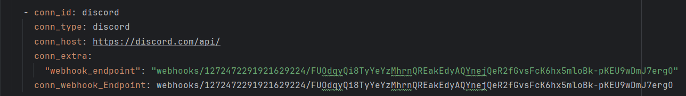

Overview
========

Welcome to My Project! This project was generated after you ran 'astro dev init' using the Astronomer CLI. This readme describes the contents of the project, as well as how to run Apache Airflow on your local machine.

If you do not have Astro install follow this [Link For Window](https://www.astronomer.io/docs/astro/cli/install-cli?tab=windowswithwinget#install-the-astro-cli)

Project Contents
================

Your Astro project contains the following files and folders:

- dags: This folder contains the Python files for your Airflow DAGs.
    - `EPOS_practice`: This DAG will be our main project
- Dockerfile: This file contains a versioned Astro Runtime Docker image that provides a differentiated Airflow experience. If you want to execute other commands or overrides at runtime, specify them here.
- include: This folder contains any additional files that you want to include as part of your project. It is empty by default.
  - `data folder` mounted to minio data.
  - `EPOS_practice`: This folder contains subtasks that can be used in dags
- packages.txt: Install OS-level packages needed for your project by adding them to this file. It is empty by default.
- requirements.txt: Install Python packages needed for your project by adding them to this file. It is empty by default.
- plugins: Add custom or community plugins for your project to this file. It is empty by default.
- airflow_settings.yaml: Use this local-only file to specify Airflow Connections, Variables, and Pools instead of entering them in the Airflow UI as you develop DAGs in this project.
- 

Deploy Your Project Locally
===========================

1. Start Airflow on your local machine by running 'astro dev start'.

This command will spin up 4 Docker containers on your machine, each for a different Airflow component:

- Postgres: Airflow's Metadata Database
- Webserver: The Airflow component responsible for rendering the Airflow UI
- Scheduler: The Airflow component responsible for monitoring and triggering tasks
- Triggerer: The Airflow component responsible for triggering deferred tasks

2. Verify that all 4 Docker containers were created by running 'docker ps'.

Note: Running 'astro dev start' will start your project with the Airflow Webserver exposed at port 8080 and Postgres exposed at port 5432. If you already have either of those ports allocated, you can either [stop your existing Docker containers or change the port](https://www.astronomer.io/docs/astro/cli/troubleshoot-locally#ports-are-not-available-for-my-local-airflow-webserver).

3. Access the Airflow UI for your local Airflow project. To do so, go to http://localhost:8080/ and log in with 'admin' for both your Username and Password.

You should also be able to access your Postgres Database at 'localhost:5432/postgres'.

# What Happens In This Project?
## 1. At First Look at EPOS_practice3.py
  - In this file, we will create a dag `EPOS_practice3`. The status of this dag will be notified through Discrod. Please go to airflow_settings.yaml of your own ( my project will do have this due to security ) and set the connection for discord.
    For example:
    
## 2. Then, we will create a sensor task with decorator @task.sensor to handle our logic. The sensor will affect our pipeline if the api available or not
  - First, we need to check if the connection is available (In my case is ORACLE DB) using `is_api_oracle_available` function. The result of this task will be stored in xcom for further usage
  - Then to store the data that we get from api to minio, we first need to create buck by using function `_create_bucket` that is in the include/EPOS_practice folder for subtasks
    - After our bucket is created, we need to use the DockerOperator to send this task to pyspark container to get the large amount of data from oracle to minio stored in parquet format. The task sent to pyspark container is  the function `spark/notebooks/EPOS_practice/extract2minio.py`.
      This task will be executed by seperated container (created by running this the Dockerfile in EPOS_practice). First cd to the `spark/notebooks/EPOS_practice/` then run the commandline `docker build -t airflow/stock-app .`
  - When the parquet files are created and stored in minio, we will execute the simple join of 2 parquet files stored in minio by using seperated spark container we created above. This container will join 2 large parquet files and store back to minio
  - Then to store the data back to oracle, we need to create a new table for created join table stored in minio. So wee continue to use a seperated pyspark container to get the fields to create table by passing the file `spark/notebooks/EPOS_practice/init_create_table_script.py`. If run successfully, the script to create table will be written to `include/tmp/create_table.json`
  - After that i will store this script to xcom for further usage by using task `read_create_table_json`
  - Then, i will pull the script to create table and passing it to the function `include/epos_task/_create_table` for the task `create_table`
  - Finally, i again use seperated pyspark container to load data from minio join parquet file to oracle table by passing function `spark/notebooks/EPOS_practice/load_to_oracle.py` to pyspark container.